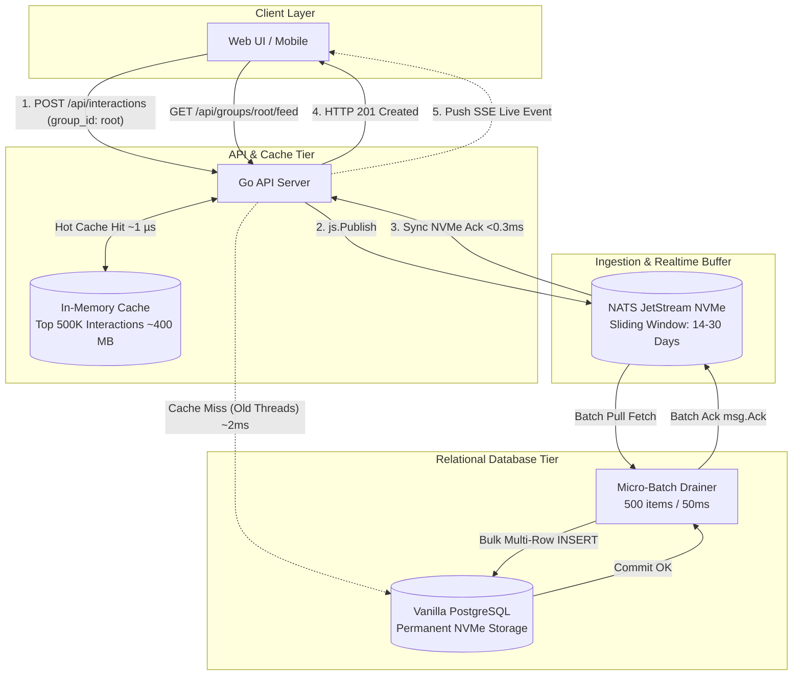

# Architecture Plan: Message Board Data Handling & Persistence

## Goal Description
Design the production-grade data handling and persistence architecture for a high-performance message board application in Go.

Based on architectural evaluations and design decisions, the chosen stack is:
- **Write Path & Buffer**: NATS JetStream with sliding-window retention (14–30 days) for sub-millisecond write acks and real-time SSE fan-out.
- **Relational Persistence**: **Vanilla PostgreSQL** on NVMe storage.
- **Micro-Batch Ingestion**: Background JetStream pull worker batching up to 500 items / 50ms into PostgreSQL to eliminate WAL transaction overhead.
- **Hot Read Shield**: In-memory cache on API replicas holding recent interactions (~400 MB RAM for 500k items) delivering ~1 µs reads and protecting PostgreSQL from connection spikes.
- **Unified Domain Model**: A single recursive `Interaction` tree schema with time-ordered **UUIDv7** identifiers and **`group_id`** (defaulting to `"root"`) for multi-board partitioning.

---

## 1. System Architecture Overview



---

## 2. Storage Strategy: Why Vanilla PostgreSQL on NVMe is Ideal

### A. Dispensing with TimescaleDB Complexity
* **NVMe Storage is Cheap and Huge**:
  * 100 Million posts + 500 Million replies is ~310 GB raw data (~450–500 GB on NVMe including B-Tree indexes and TOAST compression).
  * A single 1TB or 2TB enterprise NVMe SSD or cloud disk ($30–$60/mo) comfortably holds decades of message board history on vanilla PostgreSQL without needing TimescaleDB or manual S3 tiering.
* **Buffer Pool Locality**:
  * PostgreSQL's `shared_buffers` + OS page cache automatically keeps the active 5% working set in RAM.
  * Cold 2-year-old threads remain on NVMe blocks and are retrieved in **1–3 ms** on demand.

### B. Eliminating Duplicate Storage via Sliding-Window JetStream
* JetStream retention is configured with `MaxAge: 14 * 24 * time.Hour` (or 30 days).
* JetStream only acts as:
  1. The fast write-ahead log absorbing traffic spikes.
  2. The real-time SSE event pipeline.
* Once messages age past the sliding window, JetStream purges them.
* PostgreSQL serves as the sole permanent source of truth. JetStream disk usage stays bounded at a few gigabytes.

---

## 3. Asynchronous Micro-Batch Drainer Pipeline

### Pipeline Mechanics
1. **Write Request (Creation with Idempotency)**:
   - Client sends `POST /v1/interactions`.
   - Client may supply an optional `Idempotency-Key` HTTP header.
   - If `Idempotency-Key` is provided:
     - Checked against database / cache; if already processed, returns `200 OK` with existing interaction.
     - Sets `Nats-Msg-Id` header to the idempotency key for JetStream deduplication.
     - Deterministic ID derived or parsed from the idempotency key.
   - If no `Idempotency-Key` is provided:
     - Go generates a **UUIDv7** (RFC 9562).
   - Validates constraints: `author` (1–100 chars), `body` (1–65535 chars), `title` (1–255 chars, root only).
   - Interaction is initialized with `version: 1`.
   - Event `InteractionCreatedEvent` is published to JetStream `BOARD.<group_id>.evt.created`.
   - On JetStream disk ack (~0.25 ms), API returns `HTTP 201 Created` immediately.

2. **Edit Request (Optimistic Concurrency Control)**:
   - Client sends `PUT /v1/interactions/{id}` with `body`, optional `title`, and `version`.
   - Server validates version against current database state (`WHERE id = $1 AND version = $2`).
   - If version does not match, returns `HTTP 409 Conflict`.
   - On match, increments `version = version + 1`, updates `updated_at = NOW()`.
   - Publishes `InteractionEditedEvent` with the new incremented version to prevent stale out-of-order event overwrites.
   - Returns `HTTP 200 OK` with updated interaction.

3. **Batch Drainer Worker**:
   - Pull consumer fetches up to **500 messages or waits 50 ms**.
   - Executes a bulk insert into PostgreSQL:
     ```sql
     INSERT INTO interactions (
         id, group_id, root_id, parent_id, title, body, author, created_at, updated_at, reply_count, depth, version
     ) VALUES 
         ($1, $2, $3, $4, $5, $6, $7, $8, $9, $10, $11, $12),
         ...
     ON CONFLICT (id) DO NOTHING;
     ```
   - On successful transaction commit, acknowledges all messages in the batch (`msg.Ack()`).
   - If PostgreSQL temporarily stalls, JetStream safely buffers incoming writes without blocking users.

---

## 4. Unified Domain & Relational Schema (with `group_id` & `version`)

### Go Model
```go
type Interaction struct {
    ID         uuid.UUID  `json:"id"`                    // UUIDv7 (time-ordered)
    GroupID    string     `json:"group_id"`              // Board/Group ID (defaults to "root", max 64)
    RootID     *uuid.UUID `json:"root_id,omitempty"`     // Conversation root ID (nil for top-level posts)
    ParentID   *uuid.UUID `json:"parent_id,omitempty"`   // Immediate parent ID (nil for top-level posts)
    Title      *string    `json:"title,omitempty"`       // Populated for root posts, nil for replies (max 255)
    Body       string     `json:"body"`                  // Markdown content (max 65535)
    Author     string     `json:"author"`                // Display name (max 100)
    CreatedAt  time.Time  `json:"created_at"`
    UpdatedAt  *time.Time `json:"updated_at,omitempty"`
    ReplyCount int        `json:"reply_count"`
    Depth      int        `json:"depth"`                 // 0 = root post, 1 = direct reply, 2+ = nested
    Version    int        `json:"version"`               // Optimistic concurrency version (starts at 1)
}
```

### PostgreSQL DDL
```sql
CREATE TABLE interactions (
    id UUID PRIMARY KEY,                          -- UUIDv7 (timestamp-ordered)
    group_id VARCHAR(64) NOT NULL DEFAULT 'root', -- Board/Group partition
    root_id UUID,                                 -- NULL for root posts; points to conversation root
    parent_id UUID,                               -- NULL for root posts; points to immediate parent
    title VARCHAR(255),                           -- NULL for replies; populated for root posts (max 255)
    body TEXT NOT NULL,                           -- Up to 65,535 chars
    author VARCHAR(100) NOT NULL,                 -- Max 100 chars
    created_at TIMESTAMPTZ NOT NULL,
    updated_at TIMESTAMPTZ,
    reply_count INT NOT NULL DEFAULT 0,
    depth INT NOT NULL DEFAULT 0,
    version INT NOT NULL DEFAULT 1                -- Incremented on every edit
);

-- Composite index for feed per board/group (pagination / scrollback)
CREATE INDEX idx_interactions_group_feed 
ON interactions (group_id, created_at DESC) 
WHERE parent_id IS NULL;

-- Index for fetching an entire conversation thread in one seek
CREATE INDEX idx_interactions_thread 
ON interactions (root_id, created_at ASC);
```

### Query Patterns
1. **Board Feed (Scrollback Pagination for a Board/Group)**:
   ```sql
   SELECT * FROM interactions 
   WHERE group_id = $group_id 
     AND parent_id IS NULL 
     AND created_at < $cursor_time 
   ORDER BY created_at DESC 
   LIMIT 20;
   ```
2. **Entire Conversation Thread**:
   ```sql
   -- Single O(1) B-Tree seek retrieves the root post and all replies in chronological order
   SELECT * FROM interactions 
   WHERE id = $id OR root_id = $id 
   ORDER BY created_at ASC;
   ```

---

## 5. Latency Profile Summary

| Operation | In-Memory Hot Cache (~400 MB) | PostgreSQL Warm NVMe | PostgreSQL Under Heavy Traffic |
| :--- | :--- | :--- | :--- |
| **Write Interaction (Sync Ack)** | **~0.25 ms** *(JetStream Ack)* | Async batch worker | Async batch worker (unaffected) |
| **Top 20 Feed (Recent Posts)** | **~1.1 µs** *(RAM read)* | 1.0 – 2.0 ms | 40 – 150 ms *(connection contention)* |
| **Recent Thread (Post + Replies)**| **~1.2 µs** *(RAM read)* | 1.5 – 3.0 ms | 50 – 200 ms |
| **Old Thread (2+ Years Ago)** | Cache Miss | **1.5 – 3.0 ms** *(NVMe seek)* | 10 – 30 ms |
